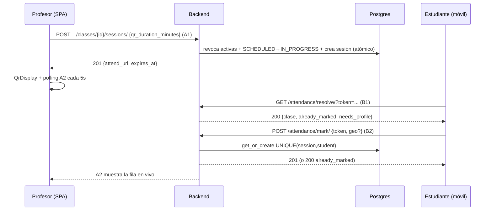
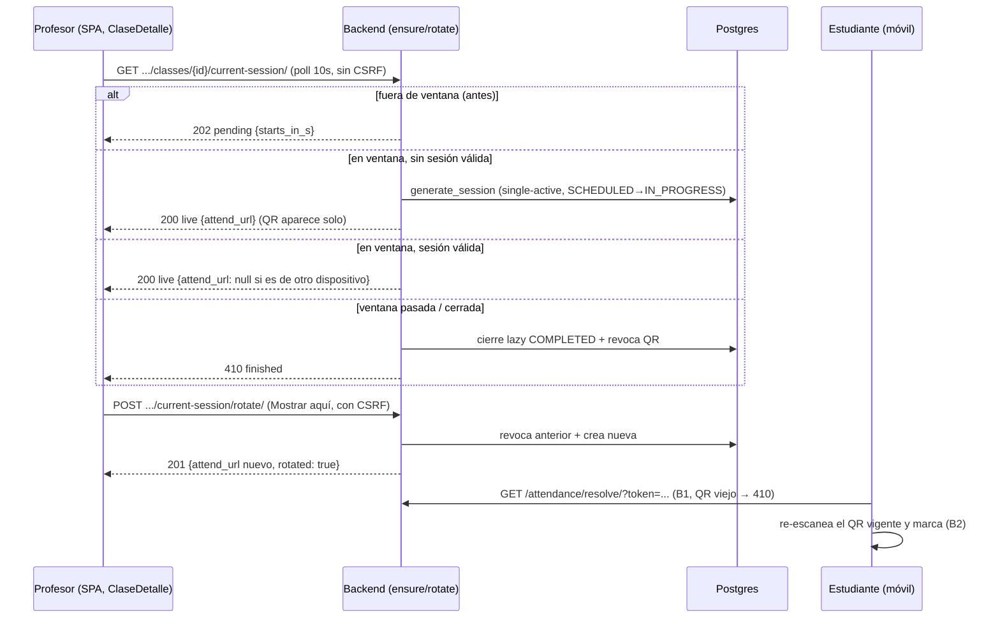

# Sprint: Asistencia por QR v2 — Sesiones, Marcación y Perfiles + QR automático v2.1

**Estado:** implementado · **Veredicto QA:** APROBADO (auto-QR con residuales menores no bloqueantes R1–R5, ver §7.7) + **APROBADO fix inmediata §7.8 (solo frontend, sin migraciones).**
**Alcance:** núcleo de asistencia (app `attendance` + `authentication` + `academic` + SPA). **Sin export** (RF-PROF-09 queda fuera de este sprint).
**Migraciones:** `academic/0003` (ajuste `qr_duration_minutes`, default 10) + `attendance/0002` (tablas `attendance_sessions`/`attendances` + `system_configs`) y `0003` (constraint single-active) + `authentication/0004` (`students`). El QR automático v2.1 **no agrega migraciones** (reutiliza `generate_session` single-active).
**Fuente de verdad del dominio:** `SIA-QR.md` (no se modifica).
**Docs previos:** [`docs/SPRINT-panel-profesor.md`](SPRINT-panel-profesor.md) · [`docs/SPRINT-crud-profesor.md`](SPRINT-crud-profesor.md) · [`docs/SPRINT-mejoras-cursos.md`](SPRINT-mejoras-cursos.md) (no se duplica; aquí solo lo nuevo de este sprint).

## 1. Qué cambió

### 1.1 Backend — modelos

- `Student` (`authentication/0004`): perfil 1–1 con `User` (`student_code` y `document_number` únicos, `first_name`, `last_name`, `address`). **No se autocrea**: se crea/actualiza solo vía `PATCH /api/auth/me/` (ver 1.4).
- `AttendanceSession` (`attendance/0002` + `0003`): `scheduled_class` (FK `class_id`, cascade), `token_hash` SHA-256 único (el token crudo **nunca** se persiste), `expires_at`, `is_active` (default `True`).
  - **Single-active Opción A:** `UniqueConstraint(fields=["scheduled_class"], condition=Q(is_active=True), name="unique_active_session_per_class")` — a nivel BD solo puede existir **una sesión activa por clase**, incluso bajo concurrencia. Generar un QR nuevo revoca (`is_active=False`) los anteriores de la misma clase.
  - Índice parcial `token_hash WHERE is_active = TRUE` (ver `SIA-QR.md`).
- `Attendance` (`attendance/0002`): `UNIQUE(session, student)` (`unique_attendance_per_session`) — la BD impide físicamente la doble marcación (RNF-03). Geo opcional y anulable (`latitude/longitude/accuracy` → `NULL` si no se otorga, RNF-06). Se registran `ip_address` (respeta `X-Forwarded-For`) y `user_agent`.
- `SystemConfig` (`attendance/0002`): tabla `system_configs` (`config_key` único). Clave usada: `QR_DEFAULT_MINUTES`.

### 1.2 Backend — generación de sesiones (`attendance/services.py`, reutilizado por A1 y B3)

- Token: `secrets.token_urlsafe(32)` → se guarda `sha256(raw)`; el crudo se devuelve **una sola vez** en la respuesta de creación (el QR lo codifica en `attend_url`).
- `generate_session(clase, ttl_override)`:
  1. Resuelve TTL (ver 1.7).
  2. En `transaction.atomic()` con `select_for_update()` sobre las sesiones activas de la clase (puerta anti-carrera; el `UniqueConstraint` parcial es la garantía final): revoca activas previas, pasa `SCHEDULED → IN_PROGRESS` y crea la sesión.
  3. Reintenta hasta 3 veces ante colisión del `UNIQUE(token_hash)`; si agota, lanza `ValidationError` (las vistas lo mapean a **409**, nunca 500).
- `attend_url = {FRONTEND_URL}/attend?token={raw}`.

### 1.3 Backend — endpoints profesor (A1, A2) y clase instantánea (B3)

Base: `http://localhost:8000`. Auth: `SessionAuthentication401` (sesión Google con CSRF). Profesor = dueño del grupo (`professor_profile`); grupo/clase ajenos → **404**; anónimo → **401**.

| # | Método | Ruta | Permisos | Descripción |
|---|---|---|---|---|
| A1 | POST | `/api/academic/groups/<group_id>/classes/<class_id>/sessions/` | Profesor dueño | Genera sesión QR single-active sobre clase existente. Body opcional `{qr_duration_minutes: 1–120}`. Clase `COMPLETED/CANCELLED` → **409**. Colisión/carrera → **409** reintentable |
| A2 | GET | `/api/attendance/sessions/<session_id>/attendances/?page=` | Profesor dueño (`IsOwnerProfessor`) | Lista viva paginada (10/máx 50). Serializer **sin lat/long exactas**: `{id, student_name, student_code, registered_at, has_location}`. Sesión ajena → **403** |
| B3 | POST | `/api/academic/groups/<group_id>/classes/instant/` | Profesor dueño | Crea clase `IN_PROGRESS` ("al momento", título default `Clase inmediata HH:MM` Bogotá, `duration_minutes` default 60) + sesión QR en **una transacción atómica**. Body opcional `{title, modality, duration_minutes, qr_duration_minutes}` |

**Ejemplo A1 — generar QR (201):**

```http
POST /api/academic/groups/<g>/classes/<c>/sessions/
X-CSRFToken: <token>
Content-Type: application/json

{"qr_duration_minutes": 10}
```

```json
{
  "session_id": "uuid-sesion",
  "token_raw": "solo-esta-vez",
  "attend_url": "http://localhost:3000/attend?token=solo-esta-vez",
  "expires_at": "2026-09-27T15:40:00-05:00",
  "ttl_minutes": 10
}
```

**Ejemplo B3 — clase instantánea (201):**

```http
POST /api/academic/groups/<g>/classes/instant/
Content-Type: application/json

{"title": "Repaso", "modality": "PRESENTIAL", "duration_minutes": 60, "qr_duration_minutes": 10}
```

```json
{
  "class": { "id": "uuid-clase", "title": "Repaso", "status": "IN_PROGRESS", "...": "ver ScheduledClassSerializer" },
  "session": { "session_id": "uuid-sesion", "token_raw": "solo-esta-vez", "attend_url": "http://localhost:3000/attend?token=...", "expires_at": "...", "ttl_minutes": 10 }
}
```

### 1.4 Backend — endpoints estudiante (B1, B2) y perfil (PATCH /me, GET /csrf)

| # | Método | Ruta | Auth | Descripción |
|---|---|---|---|---|
| B1 | GET | `/api/attendance/resolve/?token=<crudo>` | Cualquier usuario autenticado (anónimo → **401**, no 403) | Resuelve token → sesión/clase/grupo + `expires_at`, `already_marked`, `needs_profile`. Sin `token` → **400**. Token desconocido → **404**. Expirado/revocado o clase cerrada → **410** |
| B2 | POST | `/api/attendance/mark/` | Estudiante autenticado | Marca asistencia (idempotente). No-estudiante → **403**. Sin perfil `Student` → **412 + needs_profile** (ver abajo). Token inválido → **404**; expirado/revocado → **410**; clase cerrada → **409**; duplicado concurrente → `200 already_marked` (nunca 500) |
| — | GET / PATCH | `/api/auth/me/` | Sesión | **GET**: perfil + `needs_profile` (estudiante sin `Student`) y reconciliación de rol (M2). **PATCH estudiante**: crea/actualiza perfil real `{student_code, document_number, first_name, last_name}` (RF-EST-03); duplicados → **409** legible por campo. **PATCH profesor**: `{employee_code, department?}` |
| — | GET | `/api/auth/csrf/` | Ninguna | Fija cookie `csrftoken` para el SPA (`ensure_csrf_cookie`) |

**Ejemplo B1 — resolver (200):**

```http
GET /api/attendance/resolve/?token=<crudo>
```

```json
{
  "session_id": "uuid-sesion",
  "expires_at": "2026-09-27T15:40:00-05:00",
  "is_active": true,
  "already_marked": false,
  "needs_profile": false,
  "class": { "id": "uuid", "title": "Repaso", "status": "IN_PROGRESS", "modality": "PRESENTIAL", "start_time": "..." },
  "group": { "id": "uuid", "group_code": "01", "course_name": "Cálculo I" }
}
```

**Ejemplo B2 — marcar (201 primera vez / 200 si ya marcó):**

```http
POST /api/attendance/mark/
X-CSRFToken: <token>
Content-Type: application/json

{"token": "<crudo>", "latitude": 4.12345678, "longitude": -75.12345678, "accuracy": 12.5}
```

```json
// 201 (primera vez) o 200 (reintento idempotente)
{ "attendance_id": "uuid", "session_id": "uuid-sesion", "registered_at": "...", "already_marked": false }
```

```json
// 412 — sin perfil (el frontend muestra StudentProfileForm y reintenta)
{ "error": "Completa tu perfil de estudiante (código, documento y nombre) antes de marcar asistencia.", "needs_profile": true }
```

**Ejemplo PATCH perfil estudiante (200; duplicado → 409):**

```http
PATCH /api/auth/me/
Content-Type: application/json

{"student_code": "202421234", "document_number": "1234567890", "first_name": "Ana", "last_name": "Pérez"}
```

### 1.5 Tabla de errores

| Código | Dónde | Significado en SIA-QR | Acción del frontend |
|---|---|---|---|
| 400 | B1 sin `token`, B2 schema inválido, B3 `modality`/`duration` inválidos, PATCH perfil incompleto | Petición malformada | Muestra mensaje de campo |
| 401 | Cualquier endpoint con sesión ausente/inválida (`SessionAuthentication401` + `Auth401Mixin`) | Sin sesión Google | Redirige a login Google (`/attend` guarda el token en `localStorage` y lo reanuda al volver) |
| 403 | B2 con rol no-estudiante; A2 con sesión ajena; `403 CSRF` sin `X-CSRFToken` | Prohibido | Mensaje ("Solo los estudiantes…"); CSRF → `ensureCsrf()` + reintentar |
| 404 | B1/B2 token desconocido; A1/B3 grupo/clase ajenos | No encontrado | "El código QR no es válido" / reintentar |
| 409 | A1/B3 en clase `COMPLETED/CANCELLED` o colisión/carrera; B2 en clase cerrada; PATCH perfil duplicado (`student_code`/`document_number`) | Conflicto, **reintentable** | Regenerar QR / mostrar error de unicidad por campo |
| 410 | B1/B2 sesión expirada (`expires_at`), revocada (`is_active=False`) o clase cerrada (B1) | QR vencido (RNF-02) | "QR expirado — genera uno nuevo" (+ botón Reintentar en `/attend`) |
| 412 | B2 sin perfil `Student` | Falta completar perfil (RF-EST-03) | Muestra `StudentProfileForm`, guarda vía `PATCH /me` y re-resuelve |

### 1.6 Backend — reglas transversales

- `reconcile_professor_role` (M2): en cada `GET/PATCH /me`, si el email está en la whitelist de profesores se promueve `STUDENT → PROFESSOR` (creando el perfil `Professor` si falta). Solo promueve, nunca degrada; la degradación es el `DELETE` del admin (pasa a `ROLE_STUDENT`).
- Revocación al cerrar clase (C3): `PATCH/PUT` que deje la clase en `COMPLETED`/`CANCELLED` (profesor y admin) pone `is_active=False` en sus sesiones. B1 responde **410** y B2 **409** desde ese momento.
- `logout` (`POST /api/auth/logout/`) cierra la sesión Django.

### 1.7 TTL (duración del QR)

Prioridad: `qr_duration_minutes` del body (1–120) > `ScheduledClass.qr_duration_minutes` > `SystemConfig[QR_DEFAULT_MINUTES]` > `settings.QR_DEFAULT_MINUTES` > `10`.
Defaults del modelo: `qr_duration_minutes = 10`. Instantánea: si el frontend no envía TTL, se usa el default (10).

### 1.8 Frontend

- `services/api.js`: instancia axios con `baseURL = REACT_APP_API_BASE || http://localhost:8000`, `withCredentials: true`, `xsrfCookieName: csrftoken / xsrfHeaderName: X-CSRFToken / withXSRFToken: true`. `ensureCsrf()` (`GET /api/auth/csrf/`) con memoización + interceptor que la garantiza antes de cada `POST/PUT/PATCH/DELETE`. `API_BASE` y `FRONTEND_BASE` exportadas; `googleLoginUrl(next)` preserva el `?next=` hacia `/attend?token=`.
- `services/attendance.js`: `resolveToken`, `markAttendance` (devuelve `{data, status}` para distinguir 200/201), `createClassSession` (A1), `getSessionAttendances` (A2 paginado).
- `services/academic.js`: nuevo `createInstantClass(groupId, payload?)` (B3).
- Ruta `/attend?token=` (`App.js` → `pages/AttendQR.js`): fases `no-token → login → resolving → ready → done/already | error`. Lee el token de la URL y lo respalda en `localStorage` (`siaqr_pending_token`) **antes** de redirigir a Google (M4), para reanudar aunque se pierda el `?next=`. Incluye `StudentProfileForm` (alta real vía `PATCH /me`, errores 400/409 por campo) cuando `needs_profile` (B1) o **412** (B2). Geo **opcional y no bloqueante**: se pide solo en fase `ready` (`getCurrentPosition`, timeout 8 s); denegada/ausente → se marca sin ubicación. Éxito → pantalla verde con hora exacta Bogotá (`utils/dates.formatBogota`).
- `components/QrDisplay.js` (`qrcode.react@^3.2.0`, `QRCodeSVG`): renderiza `attend_url` + **countdown en vivo** (`Expira en MM:SS` / `QR expirado — genera uno nuevo`). El token crudo **nunca** se muestra como texto.
- `pages/ClaseDetalle.js`: input TTL (default `qr_duration_minutes ?? 10`) + botón **Generar QR** (A1) → `QrDisplay` + lista viva con **polling cada 5 s** (badge `● en vivo (5s)`, paginación local) mostrando `student_name`, `student_code`, hora Bogotá y `📍 con/sin ubicación`. `409` → mensaje de clase cerrada; error de TTL → mensaje de campo.
- `pages/CursoDetalle.js`: bloque clase instantánea con título opcional (default backend `Clase inmediata HH:MM`) + TTL (default 10) → B3.

### 1.9 Seguridad

- `SessionAuthentication401`: `SessionAuthentication` estándar **con enforcement CSRF** (sin exenciones), pero con cabecera `WWW-Authenticate` para que la falta de sesión sea **401** (no 403).
- Cookies: `SESSION_COOKIE_*` (`HttpOnly`, `SameSite=Lax`, `Secure` según env) y `CSRF_COOKIE_*` (`HttpOnly=False` para que axios lea `csrftoken`, `SameSite=Lax`, `Secure` según env).
- `SECRET_KEY` obligatoria en producción (`DEBUG=False` no arranca sin `DJANGO_SECRET_KEY`); `DEBUG` default `False`.
- `CSRF_TRUSTED_ORIGINS`: por env o derivado de `CORS_ALLOWED_ORIGINS + FRONTEND_URL` — **debe incluir el origen del frontend** o los `POST` con `X-CSRFToken` fallan con 403.
- Tokens QR: solo viaja el crudo en la respuesta de creación y en la URL escaneada; en BD solo el hash SHA-256; el frontend jamás lo imprime.

## 2. Variables de entorno

| Variable | Default / ejemplo | Efecto |
|---|---|---|
| `FRONTEND_URL` | `http://localhost:3000` | Construye `attend_url` del QR y `LOGIN_REDIRECT_URL` post-Google |
| `QR_DEFAULT_MINUTES` | `10` (1–120) | `settings.QR_DEFAULT_MINUTES`; penúltimo eslabón de la cadena de TTL (puede ser sobreescrito por `SystemConfig[QR_DEFAULT_MINUTES]`) |
| `CSRF_TRUSTED_ORIGINS` | Derivado de `CORS_ALLOWED_ORIGINS + FRONTEND_URL` | Orígenes de confianza CSRF; incluir siempre el origen del SPA |
| `CORS_ALLOWED_ORIGINS` | `http://localhost:3000,http://127.0.0.1:3000` | Orígenes permitidos CORS (con esquema) |
| `COOKIE_SECURE` | `True` en producción, `False` con `DEBUG=True` | `Secure` en cookies de sesión/CSRF (forzar `True` solo con HTTPS local) |
| `REACT_APP_API_BASE` (frontend) | `http://localhost:8000` | `baseURL` de axios en el SPA |
| `DJANGO_SECRET_KEY` / `DJANGO_DEBUG` / `DJANGO_ALLOWED_HOSTS` | ver `.env.example` | Clave, modo debug y hosts permitidos |
| `POSTGRES_*` | ver `.env.example` (`HOST=db` en Docker, `localhost` en host) | Conexión Postgres; cambiarlos tras el primer arranque exige `down -v` |

## 3. Flujos

### 3.1 Clase programada (profesor → estudiante)



### 3.2 Clase instantánea

Igual que 3.1, pero el primer paso es un único `POST .../classes/instant/` (B3) que crea clase `IN_PROGRESS` + sesión en una transacción. TTL/título opcionales (defaults: 10 min / `Clase inmediata HH:MM`).

### 3.3 Single-active y polling

- **Single-active (Opción A):** cada `generate_session` desactiva las sesiones activas previas de la clase dentro de una transacción con `select_for_update()`; el `UniqueConstraint` parcial es la red de seguridad. Efecto visible: al generar un QR nuevo, el anterior queda inválido (**410**).
- **Polling (restricción No-Redis):** sin WebSocket; `ClaseDetalle` re-consulta A2 cada 5 s (paginado). El QR expira por `expires_at` (TTL) o por revocación al cerrar la clase.

## 4. Guía de uso

### Profesor

1. Login → Mis Cursos → grupo → clase (o **⚡ inmediata** con título/TTL opcionales).
2. En `ClaseDetalle`, ajusta *TTL del QR* y pulsa **Generar QR**; proyecta el código.
3. Observa la lista **en vivo (5 s)**. Para rotar el código, genera uno nuevo (el anterior se invalida).
4. Cerrar la clase (`COMPLETED`/`CANCELLED`) revoca sus QR automáticamente.

### Estudiante (móvil, sin app nativa)

1. Escanea el QR → `/attend?token=…`.
2. Si no hay sesión, inicia sesión con Google institucional (`@ut.edu.co`); el token se conserva y se reanuda solo.
3. Si es tu primera vez, completa el perfil (código, documento, nombres) — una sola vez.
4. Pulsa **MARCAR ASISTENCIA** (la ubicación es opcional). Verás confirmación verde con la hora exacta. Reintentar es seguro: el segundo envío responde `already_marked`.

## 5. Cómo probar (E2E en Docker)

```bash
cp .env.example .env        # POSTGRES_HOST=db dentro de Docker
docker compose up --build -d
docker compose exec backend python manage.py migrate
# Frontend: http://localhost:3000 · Backend: http://localhost:8000
```

1. **A1:** como profesor, `POST .../classes/<c>/sessions/ {"qr_duration_minutes": 10}` → `201` con `attend_url`; repetir → `201` nueva y la anterior pasa a **410** en B1.
2. **A2:** `GET /api/attendance/sessions/<s>/attendances/` → `200` paginado sin lat/long (`has_location` booleano); sesión ajena → `403`.
3. **B1:** `GET /api/attendance/resolve/?token=<crudo>` → `200`; sin token → `400`; token falso → `404`; expirado → `410`; anónimo → `401`.
4. **B2:** `POST /api/attendance/mark/ {"token": …}` → `201`; repetir → `200 already_marked`; sin perfil → `412 needs_profile`; geo inválida → `400`; clase cerrada → `409`.
5. **B3:** `POST .../classes/instant/ {"title": "T", "qr_duration_minutes": 10}` → `201` con `class.status == IN_PROGRESS` + `session`.
6. **Perfil:** `PATCH /api/auth/me/` estudiante → `200`; duplicado `student_code`/`document_number` → `409`; `GET /me` sin `Student` → `needs_profile: true`; email en whitelist → rol promovido a profesor.
7. **CSRF:** `GET /api/auth/csrf/` fija cookie; `POST` sin `X-CSRFToken` → `403 CSRF`; con él → OK.
8. **E2E navegador:** profesor genera QR en `ClaseDetalle`; en ventana incógnito/móvil abrir `attend_url` → login → perfil (si aplica) → MARCAR → aparece en la lista viva ≤ 5 s con hora Bogotá.
9. **Verificación del sprint (reportada):** `python manage.py check` 0 errores · `migrate` (`academic 0003`, `attendance 0003`) · **19 tests OK** (suites `attendance` + `authentication`) · `npm run build` OK.

## 6. Backlog QA / residuales no bloqueantes (v2.0, vigente)

Veredicto **APROBADO**: sin críticos. Deuda registrada para no perderla:

1. **Build commiteado vs `.gitignore`:** `frontend/build/` está versionado en git aunque `.gitignore` trae `/build/` y `/dist/` con barra inicial (solo ignoran `build/` en la **raíz**, no `frontend/build/`). Decidir: ignorar `frontend/build/` (`frontend/build/` en `.gitignore`) y sacarlo del índice, o documentar que el build se versiona a propósito. *(No se toca `.gitignore` en este sprint: restricción de rol solo-docs.)*
2. **`ACCOUNT_*` deprecadas:** `python manage.py check` emite `WARNINGS` de `django-allauth` (`ACCOUNT_AUTHENTICATION_METHOD`, `ACCOUNT_EMAIL_REQUIRED`, `ACCOUNT_USERNAME_REQUIRED` → migrar a `ACCOUNT_LOGIN_METHODS` / `ACCOUNT_SIGNUP_FIELDS`). Solo warnings; planificar migración antes de subir allauth.
3. **Migración `attendance 0003` con datos legacy:** el `UniqueConstraint` parcial falla si ya existen ≥ 2 sesiones activas para la misma clase (datos creados antes del constraint). Si `migrate` falla en una BD con datos, precargar una migración de limpieza (desactivar duplicadas) o revocar a mano antes de aplicar.
4. **Deuda previa vigente:** ver Backlog en [`docs/SPRINT-panel-profesor.md`](SPRINT-panel-profesor.md), [`docs/SPRINT-crud-profesor.md`](SPRINT-crud-profesor.md) y [`docs/SPRINT-mejoras-cursos.md`](SPRINT-mejoras-cursos.md).

## 7. QR 100 % automático v2.1 — sin botón Generar (QA APROBADO)

El botón **Generar QR** se eliminó de `ClaseDetalle`. El QR aparece, rota y se
cierra solo mediante *lazy ensure* (`GET .../current-session/` + polling).
A1 (`POST .../classes/<c>/sessions/`) queda solo como **fallback interno** del
backend (la UI ya no lo llama). B3 (clase instantánea) queda **intacta**.

### 7.1 Qué cambió (resumen)

- **Sin botón Generar:** `frontend/src/pages/ClaseDetalle.js` ya no renderiza input TTL ni botón manual. Máquina de fases `loading → pending → live → finished` alimentada por `ensure` cada **10 s** (`ENSURE_MS`) + lista viva A2 cada **5 s** (`LIST_MS`), sin reload.
- **Lazy ensure** `GET /api/academic/groups/<g>/classes/<c>/current-session/` (profesor dueño, **GET puro exento de CSRF**, `Cache-Control: no-store`):
  - `200 live` — sesión vigente reusada o creada/rotada en ventana. `attend_url`/`token_raw` **solo** vienen cuando la sesión se creó en este request; en **reuso** son `null` (el crudo es irreversible: en BD solo vive su hash SHA-256).
  - `202 pending` — falta para el inicio: `{state: pending, status: SCHEDULED, starts_in_s, start_time}`.
  - `410 finished` — clase cerrada o ventana pasada (con **cierre lazy a `COMPLETED`** + revocación de QR activos).
  - `409` colisión/carrera (reintentable, nunca 500) · `503` fallo inesperado del ensure (reintentable, `Retry-After: 10`, con log).
- **Auto-rotación en ventana:** si el QR expiró (`expires_at`) y la clase sigue en ventana (`IN_PROGRESS`), el ensure genera uno nuevo (revoca el anterior, single-active). Si pasó el fin, cierra a `COMPLETED` sin rotar.
- **Segundo dispositivo** `POST .../current-session/rotate/` → **Mostrar en este dispositivo** (`201` con QR nuevo, revoca el anterior). Workaround documentado al reuso con `attend_url: null`: proyectar siempre desde el dispositivo donde se rotó por última vez.
- **Cierre lazy a `COMPLETED`:** no hay scheduler; el primer `GET`/`POST rotate` que detecta `now >= end` marca `COMPLETED` + `is_active=False` y responde `410`.
- **Timezone Bogotá aware:** `start_time` naive se normaliza a `America/Bogota` (`_ensure_aware` en `apps/academic/services.py`); sin esto la resta naive−aware lanzaba `TypeError` → 500 en el poll.
- **Caché profesor `sessionStorage`** (`siaqr:current-session:<classId>`, alcance de pestaña): conserva el QR mostrable tras reload (mismo `session_id`); se limpia al finalizar/expirar. `localStorage` **no** se usa para el QR del profesor.
- **Instantánea B3 intacta:** `POST .../classes/instant/` sigue creando clase `IN_PROGRESS` + sesión en una transacción; el ensure la detecta como `live` al instante.
- **CSRF:** `GET current-session` exento (lectura); `POST rotate` exige `X-CSRFToken` (mutación, vía `ensureCsrf()` + interceptor axios como el resto de `POST`).
- **Verificación reportada:** **45 tests OK** (suites `attendance` + `authentication` + `academic` auto-QR) · `python manage.py check` 0 errores · `npm run build` OK.

### 7.2 Ventana, gracia previa y single-active

```text
|--- gracia (EARLY_QR_GRACE_SECONDS, default 30 s) ---|--- clase (duration_minutes) ---|
start - gracia                                        start                            end
   pending (202, starts_in_s)                            live (200/201, auto-crea/rota)    finished (410 + cierre lazy)
```

- `class_window(clase) = (start_time, start_time + duration_minutes)`, ambos aware Bogotá.
- `should_auto_start = (start − gracia) <= now < end`.
- `get_early_grace_seconds()` — prioridad: `SystemConfig[EARLY_QR_GRACE_SECONDS]` (0–300, validado) > `settings.EARLY_QR_GRACE_SECONDS` (env) > `30`. Valor fuera de 0–300 → se ignora y se usa el siguiente eslabón.
- **Single-active intacto:** `generate_session()` revoca previas en `transaction.atomic()` + `select_for_update()`; el `UniqueConstraint` parcial (`unique_active_session_per_class`) es la garantía final. Cada rotación (auto o manual vía `rotate/`) invalida el QR anterior → el estudiante con el QR viejo recibe **410** y debe re-escanear.

| Variable / clave | Dónde | Rango | Default | Efecto |
|---|---|---|---|---|
| `EARLY_QR_GRACE_SECONDS` | env (`.env` / `.env.example`) → `settings.EARLY_QR_GRACE_SECONDS` | 0–300 | `30` | Segundos previos al `start_time` en que el QR ya aparece |
| `SystemConfig[EARLY_QR_GRACE_SECONDS]` | tabla `system_configs` (`config_key`/`config_value`) | 0–300 | — (si ausente, manda env) | Sobreescribe al env sin redeploy; valor inválido se ignora |

### 7.3 Endpoints auto-QR (ejemplos y errores)

Base `http://localhost:8000`. Auth sesión Google + `IsOwnerProfessor` (grupo/clase ajenos → **404**; anónimo → **401**). Todas las respuestas traen `Cache-Control: no-store`.

**GET current-session — 200 live (creada en este request):**

```http
GET /api/academic/groups/<g>/classes/<c>/current-session/
```

```json
{
  "state": "live",
  "session_id": "uuid-sesion",
  "token_raw": "solo-esta-vez",
  "attend_url": "http://localhost:3000/attend?token=solo-esta-vez",
  "expires_at": "2026-09-27T15:40:00-05:00",
  "ttl_minutes": 10,
  "status": "IN_PROGRESS"
}
```

**GET current-session — 200 live (reuso, sesión de otro poll/dispositivo):**

```json
{
  "state": "live",
  "session_id": "uuid-sesion",
  "token_raw": null,
  "attend_url": null,
  "expires_at": "2026-09-27T15:40:00-05:00",
  "ttl_minutes": 10,
  "status": "IN_PROGRESS"
}
```

> `attend_url: null` = el QR vive en otro dispositivo/pestaña. En la misma pestaña el frontend lo recupera de `sessionStorage`; en otro dispositivo pulsa **Mostrar en este dispositivo** (rota).

**GET current-session — 202 pending / 410 finished:**

```json
// 202 — aún no inicia
{ "state": "pending", "status": "SCHEDULED", "starts_in_s": 42, "start_time": "2026-09-27T15:30:00-05:00" }

// 410 — cerrada o ventana pasada (cierre lazy aplicado)
{ "state": "finished", "status": "COMPLETED", "reason": "closed" }
{ "state": "finished", "status": "COMPLETED", "reason": "window_elapsed" }
```

**POST rotate — Mostrar en este dispositivo (201 / 202 / 410):**

```http
POST /api/academic/groups/<g>/classes/<c>/current-session/rotate/
X-CSRFToken: <token>
Content-Type: application/json

{}   // body opcional: {"qr_duration_minutes": 10}
```

```json
// 201 — QR nuevo proyectable en este dispositivo (anterior revocado)
{
  "state": "live",
  "session_id": "uuid-nueva-sesion",
  "token_raw": "solo-esta-vez",
  "attend_url": "http://localhost:3000/attend?token=solo-esta-vez",
  "expires_at": "2026-09-27T15:40:00-05:00",
  "ttl_minutes": 10,
  "status": "IN_PROGRESS",
  "rotated": true
}

// 202 — aún fuera de ventana (no rota nada)
{ "state": "pending", "status": "SCHEDULED", "starts_in_s": 35, "start_time": "..." }

// 410 — clase cerrada o ventana pasada
{ "state": "finished", "status": "COMPLETED", "reason": "closed" }
```

**Tabla de errores (auto-QR):**

| Código | Endpoint | Significado | Acción del frontend |
|---|---|---|---|
| 401 | GET / POST rotate sin sesión | Sin sesión Google | Redirige a login (igual que B1/B2) |
| 403 | POST rotate sin `X-CSRFToken` | CSRF rechazado | `ensureCsrf()` + reintentar |
| 404 | GET / POST rotate grupo/clase ajenos o inexistentes | No encontrado (no fuga ownership) | "Clase no disponible" |
| 409 | GET ensure o POST rotate con colisión/carrera y sin sesión válida que reusar | Conflicto reintentable | Reintentar en el siguiente poll (GET) / mostrar "intenta de nuevo" (rotate) |
| 410 | GET / POST rotate con clase cerrada o ventana pasada; B1 con QR viejo tras rotación | QR/clase finalizados | Vista `finished`; estudiante: re-escanear el QR vigente |
| 503 (+ `Retry-After: 10`) | GET ensure o POST rotate ante fallo inesperado | Servicio degradado, reintentable | Reintentar (poll silencioso en GET; mensaje + reintento en rotate) |

### 7.4 Guía de uso (auto-QR)

**Profesor (sin botón):**

1. Login → Mis Cursos → grupo → clase. No hay nada que pulsar: la vista muestra el estado solo.
2. **Antes del inicio** (`pending`): mensaje ámbar *"el QR aparecerá automáticamente en MM:SS"* + cuenta regresiva local (resincronizada por el poll de 10 s).
3. **En ventana** (`live`): el QR aparece solo y se renueva solo al expirar. Badge verde *"● QR activo — se genera y renueva solo"*. La lista de asistencia sigue en vivo cada 5 s.
4. **Segundo dispositivo / proyector:** si ves *"Sesión activa en otro dispositivo"*, pulsa **Mostrar en este dispositivo** (rota: revoca el QR anterior y trae uno proyectable aquí). Proyecta siempre desde el dispositivo donde rotaste por última vez.
5. **Fin** (`finished`): *"La clase finalizó — ya no se generan códigos QR"*. El cierre a `COMPLETED` lo aplica el primer poll tras el fin (lazy).

**Estudiante (móvil, sin app nativa):**

1. Escanea el QR vigente → `/attend?token=…` → login Google `@ut.edu.co` (con reanudación) → perfil si es primera vez → **MARCAR ASISTENCIA** (igual que v2.0, §4).
2. **Si ves "QR expirado" (410):** el profesor rotó el código (auto-rotación por expiración o **Mostrar en este dispositivo**). **Vuelve a escanear el QR proyectado** y marca de nuevo — tu marcación anterior (si la hiciste sobre la sesión vieja) sigue válida; solo el *token* cambió.

### 7.5 Cómo probar (E2E auto-QR en Docker)

```bash
cp .env.example .env        # POSTGRES_HOST=db dentro de Docker
docker compose up --build -d
docker compose exec backend python manage.py migrate
# Frontend: http://localhost:3000 · Backend: http://localhost:8000
```

1. **Programada `now+1min`: pending → live sin reload.** Crea clase con inicio en 1 min; abre `ClaseDetalle` → `202 pending` con `starts_in_s ≈ 60` y regresiva; sin recargar, al entrar en ventana (gracia 30 s incluida) el poll de 10 s la pasa a `live` con QR.
2. **Reload conserva el QR (mismo `session_id`).** Recarga la pestaña en `live` → el QR se hidrata desde `sessionStorage` (mismo `session_id`, sin duplicar sesiones en BD).
3. **Restart del backend sin duplicados.** Reinicia `backend` en `live` → al volver, el ensure reusa la sesión válida (mismo `session_id`); no crea una nueva.
4. **Expiración rota sola en ventana.** Con TTL corto, deja expirar el QR sin cerrar la clase → el siguiente ensure genera sesión nueva (`session_id` distinto) y el QR viejo pasa a **410** en B1.
5. **Fin → finished + cierre lazy.** Deja pasar el `end` → el siguiente poll responde `410 finished` (`reason: window_elapsed`), la clase queda `COMPLETED`, el QR cacheado se limpia y la lista deja de crecer.
6. **Instantánea B3 intacta.** `POST .../classes/instant/` → `201` + el ensure la muestra como `live` al instante.
7. **Segundo dispositivo.** Abre la misma clase en otro navegador → *"Sesión activa en otro dispositivo"* → **Mostrar en este dispositivo** → `201` con `rotated: true`; el QR del primer dispositivo queda inválido (410).
8. **Verificación reportada:** `python manage.py check` 0 errores · `migrate` sin migraciones nuevas · **45 tests OK** (suites `attendance` + `authentication` + `academic`) · `npm run build` OK.

### 7.6 Diagrama auto-QR



### 7.7 Residuales R1–R5 QA (auto-QR, menores no bloqueantes)

Veredicto **APROBADO**. Deuda menor registrada para no perderla:

1. **R1 — Reuso `live` con `attend_url: null` en segundo dispositivo.** El hash es irreversible por diseño (seguridad), así que el QR no puede "viajarse" entre dispositivos: la UI muestra el aviso + **Mostrar en este dispositivo** (rota). No bloqueante: el flujo proyecta bien desde el dispositivo de rotación.
2. **R2 — Caché `sessionStorage` con alcance de pestaña.** Reload en la misma pestaña conserva el QR; pestaña nueva/incógnito del mismo navegador requiere **Rotar**. Decisión consciente (no persiste entre sesiones como `localStorage`); documentado en §7.1/7.4.
3. **R3 — Deriva de la regresiva `pending` entre polls.** La cuenta `starts_in_s` es local (−1 s) y se resincroniza cada 10 s; puede desviar ±unos segundos del servidor. Cosmético; el cambio pending→live lo manda el backend.
4. **R4 — Cierre lazy (sin scheduler).** `COMPLETED` se marca al primer poll tras el `end`; si nadie tiene `ClaseDetalle` abierto, la clase queda `IN_PROGRESS` hasta la próxima visita. Sin impacto en marcación (B1/B2 validan ventana/expiración igual).
5. **R5 — Gracia configurable en dos eslabones (`SystemConfig` > env).** El default 30 s vive en 3 lugares (constante `services.py`, `settings.py`, `.env.example`); un valor inválido se ignora en silencio (fallback al siguiente eslabón). Mejora futura: loguear el descarte y/o superficie admin para editarlo.

### 7.8 Bugfix — inmediata mostraba "Sesión activa en otro dispositivo" (QA APROBADO, solo frontend)

**Estado:** fix implementado y **APROBADO por QA**. Sin cambios de backend, sin migraciones nuevas, B3 y auto-QR programado **intactos**.

**Síntoma:** al crear una clase ⚡ inmediata (B3) desde `CursoDetalle`, la navegación a `ClaseDetalle` mostraba *"Sesión activa en otro dispositivo"* en lugar del QR recién creado, obligando a pulsar **Mostrar en este dispositivo** (rotación innecesaria).

**Causa raíz:** pérdida de `data.session` (B3) al navegar. B3 devuelve `{class, session}` con `token_raw`/`attend_url` mostrables **una sola vez**; al navegar solo con el `classId`, `ClaseDetalle` hacía `ensure` (`GET current-session/`) que reusaba la sesión válida pero con `attend_url: null` (hash irreversible, R1), cayendo en la rama "otro dispositivo".

**Fix (solo frontend, 3 archivos, sin tocar lógica de negocio backend ni configuración):**

- `frontend/src/pages/CursoDetalle.js` — propaga la sesión B3: `onClassCreated(classItem, data.session)` (pasa `initialSession` al padre en vez de descartarla).
- `frontend/src/components/ProfLayout.js` — `selectClass(classItem, initialSession)` guarda la sesión inicial en memoria + `key={selectedClass.initialSession?.session_id}` para remontar `ClaseDetalle` por sesión + limpieza al cambiar/cerrar clase para no reusar un QR viejo.
- `frontend/src/pages/ClaseDetalle.js` — si llega `initialSession` con `attend_url`, inicializa directo en fase `live` + `saveCached()` en `sessionStorage`; guard conservador: si el `ensure` devuelve el **mismo `session_id`**, no pisa el QR mostrable con el `attend_url: null` del reuso.

**Resultado (verificado por QA):**

- Inmediata muestra el QR en **< 3 s sin rotar** (0 rotaciones extra, mismo `session_id` B3 → ensure).
- Reload en la misma pestaña **conserva** el QR (hidrata `sessionStorage`, mismo `session_id`).
- Segundo dispositivo **sí** muestra el aviso + **Rotar** (`201 rotated: true`), como corresponde (R1 vigente).
- Programada intacta: flujo `pending → live` sin `initialSession`, sin regresión.

**Verificación reportada:** `python manage.py check` OK (0 errores) · `npm run build` OK. `migrate`/tests completos **pendientes en Docker** (ver §7.9).

**Observaciones menores QA (no bloqueantes, deuda futura):** comentario sobre el orden del efecto en `ClaseDetalle`, validar `expires_at` antes de hidratar caché, `loadCached` triplicado (extraer helper), `key` con misma `id` no remonta entrePolls (comportamiento actual seguro), `StrictMode` doble-efecto seguro (guard idempotente).

### 7.9 Pendientes (post-fix §7.8)

- [ ] `docker compose exec backend python manage.py migrate` en Docker (sin migraciones nuevas esperadas; validar `academic 0003` / `attendance 0003` / `authentication 0004` aplicadas).
- [ ] Suite completa en Docker: suites `attendance` + `authentication` + `academic` (base 45 tests OK pre-fix; re-ejecutar post-fix solo-frontend para confirmar sin regresión).
- [ ] E2E navegador post-fix: inmediata (< 3 s, 0 rotate) + reload (mismo `session_id`) + segundo dispositivo (aviso + Rotar) + programada `pending → live`.
- [ ] Deuda menor QA §7.8 (comentario orden efecto, valid `expires`, helper `loadCached`) — no bloqueante.

## 8. Re-auditoría QA 2026-10-02 — TTL instantánea, perfil estudiante, purga DB (APROBADO, 61 tests OK)

**Estado:** implementado · **Veredicto QA:** APROBADO.
**Verificación reportada:** `python manage.py check` 0 errores · `migrate` verde · **61 tests OK** (9 nuevos en `backend/apps/authentication/test_qa_reaudit.py`: B2×3, B4×2, B1×2, B3×1, m2×1) · `npm run build` OK.
**Docs de esta entrega:** contrato perfil en [`docs/API-perfil-estudiante.md`](API-perfil-estudiante.md) · backup/restore en [`docs/Backup-restore.md`](Backup-restore.md) · entrada dated en [`CHANGELOG.md`](../CHANGELOG.md).

### 8.1 Fix TTL instantánea (backend persiste + frontend reconcilia, defaults a 10)

**Problema:** B3 con `qr_duration_minutes` distinto del default devolvía `session.ttl_minutes` correcto pero dejaba `class.qr_duration_minutes` en el default viejo (divergencia clase↔sesión; el frontend mostraba el default).

**Backend** (`backend/apps/academic/views.py`, `InstantClassCreateView.post`, Opción B):

1. `generate_session(clase, ttl_override)` resuelve el TTL (prioridad: body 1–120 > `clase.qr_duration_minutes` > `SystemConfig[QR_DEFAULT_MINUTES]` > `settings` > `10`).
2. Tras generar, persiste `clase.qr_duration_minutes = int(result["ttl_minutes"])` + `save(update_fields=["qr_duration_minutes", "updated_at"])` dentro del mismo `transaction.atomic()` y hace `refresh_from_db()` antes de serializar.
3. Si el `save` falla (m1) → `set_rollback(True)` + **503** `{"error": "Servicio no disponible, intenta de nuevo."}` con log — nunca serializa un TTL en memoria divergente de la BD. Colisión/carrera → **409** reintentable; fallo inesperado del claim → **503** con log (M3/m3 intactos).

**Frontend:**

- `CursoDetalle.js`: tras B3 reconcilia `cls.qr_duration_minutes = session.ttl_minutes` si difieren, y propaga `initialSession` (fix §7.8 vigente).
- `ClaseDetalle.js`: `qrMinutes` se reconcilia desde la sesión vigente (`GET current-session` y `POST rotate` → `ttl_minutes` con guard `Number.isFinite`) en vez de solo `classItem.qr_duration_minutes`; la tarjeta muestra `{qrMinutes} min`.
- Defaults unificados a **10** (`ClaseDetalle useState(... ?? 10)`, `CursoDetalle instantTtl=10`, `CreateClassForm ?? 10`, modelo).

**Verificar:** `POST .../classes/instant/ {"qr_duration_minutes": 5}` → `201` con `session.ttl_minutes == 5` y `class.qr_duration_minutes == 5`; `ClaseDetalle` muestra `5 min`; reload conserva; `rotate` actualiza el contador.

### 8.2 Texto QR profesor

`ClaseDetalle.js` fase `live` muestra el badge verde exacto:

```text
● QR activo - escanea el código para tomar asistencia.
```

**Verificar:** abrir clase en ventana → badge verde con ese texto; `pending`/`finished` intactos (§7.4).

### 8.3 Formulario estudiante sin nombre + PATCH atómico (fixes B1–B4/m1–m5)

**Formulario** (`frontend/src/pages/AttendQR.js`, sin `first/last` inputs):

- Banner `Completa tu perfil de estudiante para marcar asistencia` + línea `Registrado como: <suggested_first suggested_last> (<email>)` + nota `Nombre tomado de tu cuenta de Google (solo lectura)`.
- Solo 4 campos, todos `*`: **Número de documento** (`maxLength=50`), **Código estudiantil** (`maxLength=50`), **Teléfono** (`type=tel`, `maxLength=20`), **Dirección** (`maxLength=500`). Errores 400/409 por campo; `Guardar perfil y continuar` re-resuelve (B1) y reintenta la marcación (B2).

**Backend** (`backend/apps/authentication/views.py`):

- `GET /api/auth/me/` expone `suggested_first_name/last_name` (desde `SocialAccount.extra_data`: `given_name`/`family_name`, fallback `name` partido) + `needs_profile`. Contrato completo con ejemplos en [`docs/API-perfil-estudiante.md`](API-perfil-estudiante.md).
- **B3 monónimo:** `Madonna` (una sola palabra en `name` o `given_name` sin `family_name`) → `first = last = "Madonna"`; sin nombre obtenible → `PATCH` 400 (no bloquea para siempre).
- **B2 teléfono:** regex + conteo de dígitos ≥ 7 (`_PHONE_RE` + `_phone_has_digits`); `"       "` y `"-------"` → 400.
- **m2 dirección:** tope 500 (coherente con `maxLength=500`); 501 chars → 400.
- **B4 incompleto:** `needs_profile=True` si no hay `Student` **o** `phone/address` vacíos (`NULL`/`""`/espacios) — cubre perfiles pre-migración; `mark` con perfil incompleto → **412 + `needs_profile`**.
- **B1 atomicidad:** `PATCH` en `transaction.atomic()` (check `iexact` excluyendo la propia fila + create/update); ante `IntegrityError` por carrera → re-chequeo y **409 legible, nunca 500** (incluye colisión de `user_id` por doble create concurrente).

**Tests nuevos** (`backend/apps/authentication/test_qa_reaudit.py`, 9): B2 teléfono espacios/guiones → 400 + teléfono válido → 200; B3 monónimo → 200 con `first/last` duplicados; B4 `phone=NULL` → `needs_profile` en `GET /me` + 412 en `mark`; B1 doble create mismo código → segundo 409 nunca 500 + doble patch mismo usuario nunca 500; m2 `address` 501 → 400.

```bash
docker compose exec backend python manage.py test apps.authentication.test_qa_reaudit -v 2
```

### 8.4 Purga DB + backup (scripts/Backup-Db.ps1)

- Purgados datos de prueba: `students` → **0 filas**, `users` con `role = ROLE_STUDENT` → **0 filas** (post-backup).
- Backup previo: `backups/sia_qr_20261002.dump` (formato custom `pg_dump -F c`) + script `scripts/Backup-Db.ps1` (destino host `backups/sia_qr_<timestamp>.dump`, verificación `role/count` + `students count`).
- Guía backup/restore + SQL de purga (solo pruebas): [`docs/Backup-restore.md`](Backup-restore.md).

```powershell
.\scripts\Backup-Db.ps1
docker exec sia_qr_db psql -U sia_qr -d sia_qr -c "SELECT role, count(*) FROM users GROUP BY role ORDER BY role;" -c "SELECT count(*) AS students_total FROM students;"
```
